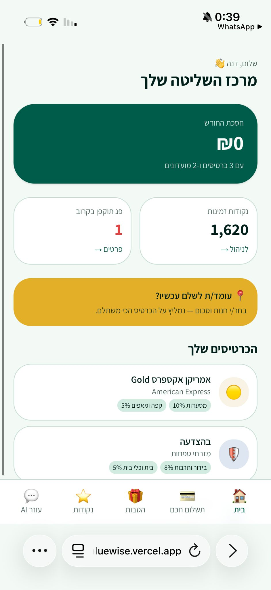

# ValueWise

**Turn every unused credit-card benefit and loyalty point into money in your pocket — at checkout.**

Live demo: [valuewise.vercel.app](https://valuewise.vercel.app)

---

## Overview

ValueWise is a Hebrew-first mobile web app that connects a user's credit cards and loyalty clubs in one place and tells them, in real time, which card to pay with to maximize savings. It is built for Israeli consumers who hold multiple cards and club memberships but lose money every month to benefits they forgot, missed, or never knew they had.

The MVP validates the core value proposition — "never leave money on the table at the register" — with two target audiences: students doing reserve duty, and career-military family members. Both hold many membership cards and have the most to lose from unused benefits.

## Key features

- **Smart Checkout** — pick a store and an amount, get a ranked list of your cards with exact shekel savings for each
- **Control Center dashboard** — running total of money saved, points available, and club memberships expiring soon
- **Benefits catalog** — every percent of cash-back and discount across your cards and clubs, filterable by category
- **Points & "trapped money" tracker** — per-club balances with expiry warnings so nothing goes to waste
- **AI assistant** — ask in natural Hebrew ("where should I eat tonight?") and get recommendations grounded in your actual wallet
- **Guided onboarding** — pick your persona, then select the cards and clubs you hold from a curated list

## Tech stack

- **Frontend**: Next.js 16 (App Router), TypeScript, Tailwind CSS v4, shadcn/ui
- **Backend**: Next.js route handlers, Supabase (Postgres + Auth + Row-Level Security)
- **AI**: Google Gemini (`gemini-flash-latest`) for the assistant and recommendation-reasoning
- **Hosting**: Vercel (production), with mobile-first PWA manifest
- **Language & direction**: Hebrew RTL throughout

## How it was built

This project was built as the final MVP for the "Entrepreneurship from 0 to 1" course at Reichman University, taught by Dr. Tamar Yogev. The codebase was written collaboratively with [Claude Code](https://www.claude.com/product/claude-code), with me acting as product manager:

- Framed the problem and chose the target personas from primary research (12 user interviews, market sizing, Lean Canvas, competitor analysis)
- Defined the feature set and prioritization — which flows belong in an MVP, which stay on the roadmap
- Made architectural calls: Hebrew-only, web PWA over native, Wizard-of-Oz data layer, shared backend with an adjacent project to stay inside a free-tier
- Scoped each screen before implementation and iterated on the copy, the persona-suggestion logic, and the fallback behavior when the AI is unavailable
- Adjusted integration choices mid-build when issues came up (e.g. swapping the AI provider when the production key didn't match the local setup)

The course deliverable — market analysis, personas, Lean Canvas, validation interviews — is the product spec this code implements.

## Screenshots

| Dashboard — Control Center | Smart Checkout — merchant picker |
|:---:|:---:|
|  |  |

| Benefits catalog | Points & expiry tracker |
|:---:|:---:|
|  |  |

| AI assistant — starter prompts | AI assistant — answer |
|:---:|:---:|
|  |  |

## Run locally

Prerequisites: Node.js 20+, a Supabase project, and a Google Gemini API key.

```bash
git clone <this-repo>
cd valuewise
npm install
```

Create `.env.local` with:

```
NEXT_PUBLIC_SUPABASE_URL=<your-supabase-url>
NEXT_PUBLIC_SUPABASE_ANON_KEY=<your-supabase-anon-key>
GEMINI_API_KEY=<your-gemini-key>
```

Apply the schema from `supabase/migrations/0001_init.sql` to your Supabase project. Then:

```bash
npm run dev
```

The app runs at `http://localhost:3000`.

## License

Academic project — not licensed for commercial use.
